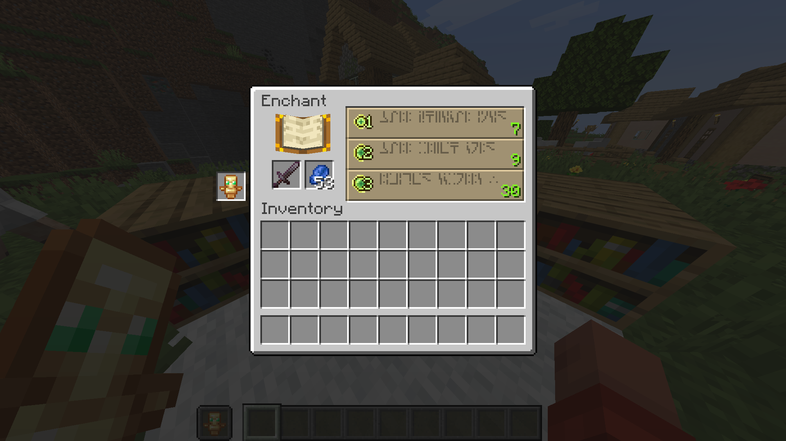

# always Off-hand

**Displayed off-hand slot in block interaction GUI(example: Crafting Table)**  
This mode is like vanilla F key actions, but is visible slot.  
**This mod is only client**
- Right Click is not supported
- Drag Click is not supported
- Wheel Click is not supported
- Q Key is not supported
- Double Click is not supported
- Slot Key is not supported
- TouchScreeen mode is not supported  
---
- Implemented using
  - Change Main-hand <-> Off-hand
  - Click Main-hand
  - Change Off-hand <-> Main-hand
- The server receives packets like the above, so please be aware